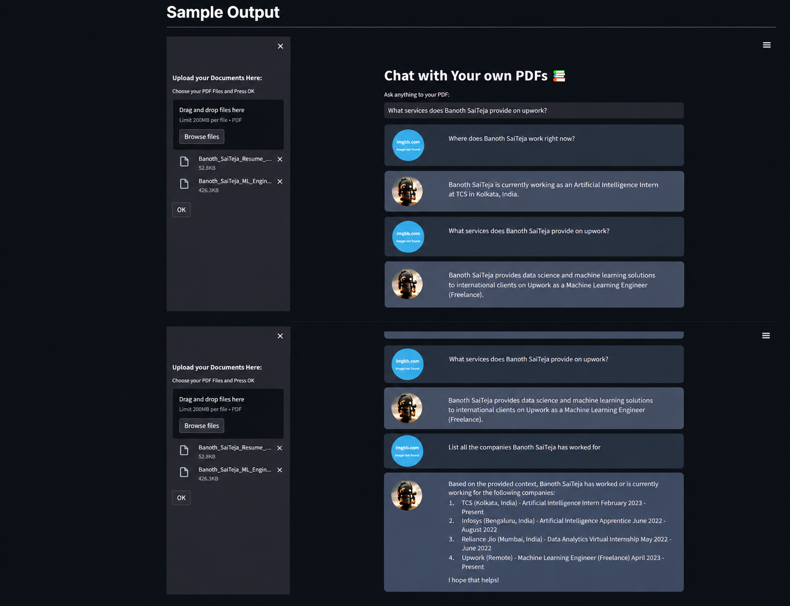

# Langchain Chatbot for Multiple PDFs

Langchain Chatbot is a conversational chatbot powered by OpenAI and Hugging Face models. It is designed to provide a seamless chat interface for querying information from multiple PDF documents. The chatbot utilizes the capabilities of language models and embeddings to perform conversational retrieval, enabling users to ask questions and receive relevant answers from the PDF content.

## Purpose

The purpose of this project is to create a chatbot that can interact with users and provide answers from a collection of PDF documents. The chatbot uses natural language processing and machine learning techniques to understand user queries and retrieve relevant information from the PDFs. By incorporating OpenAI and Hugging Face models, the chatbot leverages powerful language models and embeddings to enhance its conversational abilities and improve the accuracy of responses.

## Features

- Multiple PDF Support: The chatbot supports uploading multiple PDF documents, allowing users to query information from a diverse range of sources.
- Conversational Retrieval: The chatbot uses conversational retrieval techniques to provide relevant and context-aware responses to user queries.
- Language Models: The project incorporates OpenAI and Hugging Face models for natural language understanding and generation, enabling the chatbot to engage in meaningful conversations.
- PDF Text Extraction: The PDF documents are processed to extract the text content, which is used for indexing and retrieval.
- Text Chunking: The extracted text is split into smaller chunks to improve the efficiency of retrieval and provide more precise answers.

## Usage

-  Upload PDF documents: Use the sidebar in the application to upload one or more PDF files.
-  Ask questions: In the main chat interface, enter your questions related to the content of the uploaded PDFs.
-  Receive answers: The chatbot will generate responses based on the information extracted from the PDFs.

## Sample Output

## Future Enhancements
- Integrate Vector Database for storing embeddings. (Reach out to me if you need to get this done).
- Support for additional document formats, such as Word documents or web pages.
- Integration of more advanced language models and embeddings.
- Improved error handling and user feedback.
- Enhanced user interface and customization options.

## Contributing

Contributions are welcome! If you have any ideas, suggestions, or bug fixes, please submit a pull request or open an issue in the GitHub repository.

## License

This project is licensed under the MIT License.
